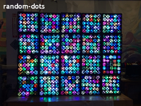
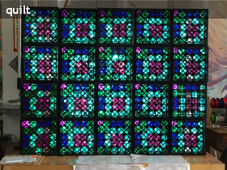
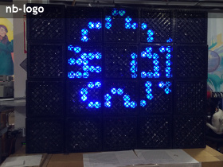
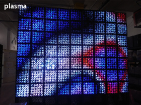
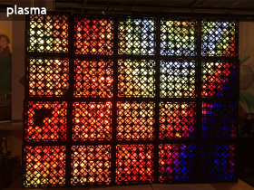
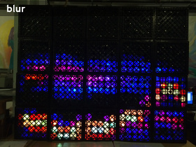

## Flaschen-Taschen Demos

By [Carl Gorringe](http://carl.gorringe.org)

Here are some programs that I wrote for the [Noisebridge Flaschen Taschen Project](https://noisebridge.net/wiki/Flaschen_Taschen), based on [code written by hzeller](https://github.com/hzeller/flaschen-taschen).

 
 
 
 
 
 
 
 


### Install How-to

This works on a unix-like OS such as Linux or Mac OS X.

#### 1. Check out original project
Before downloading my code, you'll want to first download hzeller's code.
Follow the instructions from the [Original README](https://github.com/hzeller/flaschen-taschen#tutorial-getting-started) to check out the code before proceeding to step 2.

To check out the code under Linux:

```
$ git clone --recursive https://github.com/hzeller/flaschen-taschen.git
``` 

If you're on a Mac, you may want to download the ```mac-os-compilable``` branch instead, but beware it may also be out-of-date:

```
$ git clone --recursive -b mac-os-compilable https://github.com/hzeller/flaschen-taschen.git
``` 

#### 2. Check out these demos

Next cd into the directory and download the demo code:

```
$ cd flaschen-taschen
$ git clone https://github.com/cgorringe/ft-demos.git
```

Either make & run the server locally, or use the remote servers (see original README). Set up your display using the environment var:

```
$ export FT_DISPLAY=localhost or servername
```

Now make and run the demos:

```
$ cd ft-demos
$ make all
$ ./random-dots
```

### Demos provided
1. random-dots
2. quilt
3. nb-logo
4. plasma-old
5. plasma - this version uses anti-aliasing to reduce jitter
6. blur - burred simulated sound waves or rectangles
7. lines


_____

## License

Copyright (c) 2016 Carl Gorringe. All rights reserved.

Licensed under the the terms of the [GNU General Public License version 2 (GPLv2)](http://gnu.org/licenses/gpl-2.0.html).
